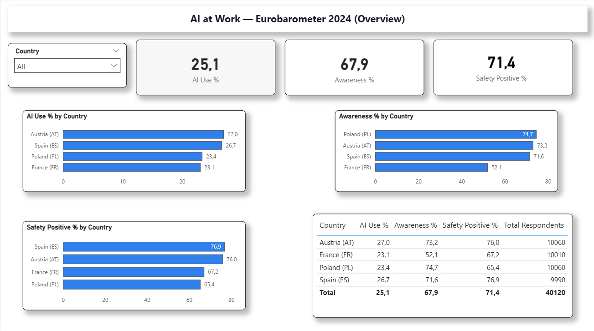
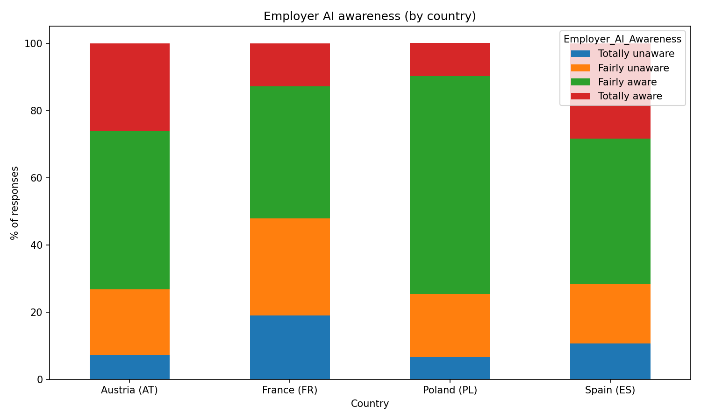
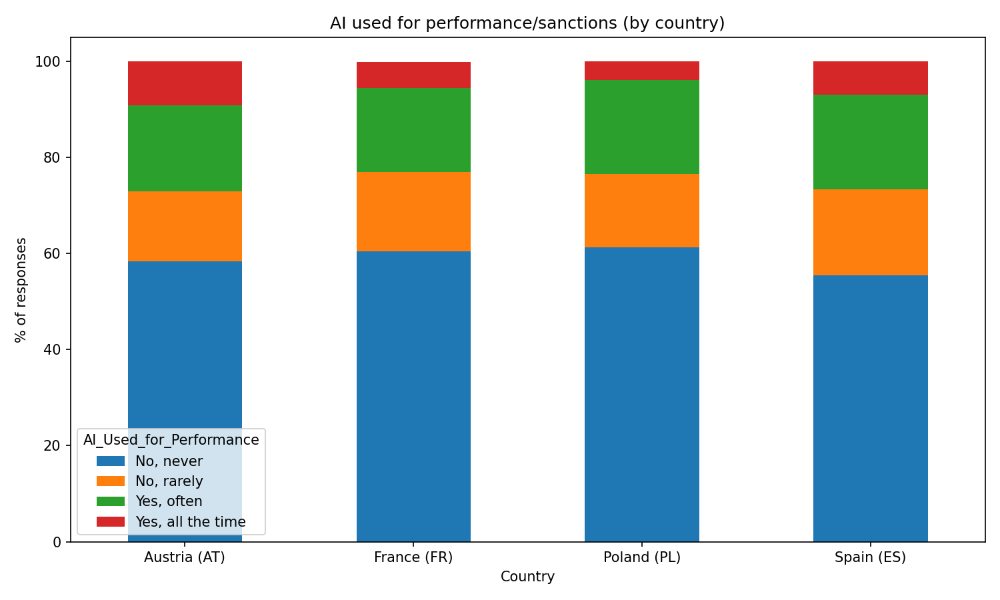
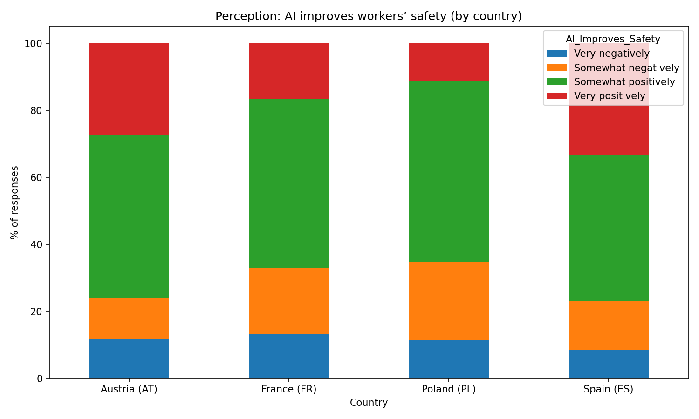
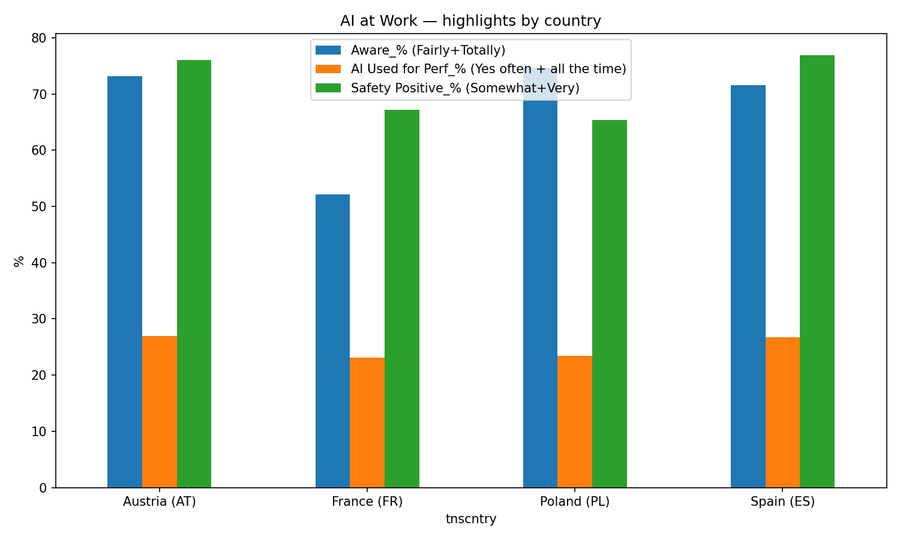

# AI at Work — Eurobarometer 2024 (EB 101.4)

**Goal:** analyze how workers across selected EU countries perceive and experience AI at work:
- **Employer AI awareness**
- **AI used for performance/sanctions**
- **Perception that AI improves workers’ safety**

**Stack:** Python (Pandas, Matplotlib) · Jupyter · Power BI · Eurobarometer 101.4 (2024, GESIS ZA8844)

---

## 🔎 Power BI Overview (Interactive)



- Open the dashboard: **`powerbi/ai-at-work.pbix`**
- Use the **Country** dropdown (top-left) — all cards and charts update.
- KPI cards: **AI Use %**, **Awareness %**, **Safety Positive %** (all shown with 1 decimal).
- Table shows country values + total respondents (n).

---

## 📊 Python Charts (Static)

**Employer AI awareness (by country)**  


**AI used for performance/sanctions (by country)**  


**Perception: AI improves workers’ safety (by country)**  


**Highlights used in this summary**  


> CSV behind the visuals: **`output/highlights.csv`** (values in **0–100**, not 0–1).

---

## 📁 Repo Structure

```text
ai-at-work-eurobarometer-2024/
├─ data/                        # raw / licensed inputs (not committed)
│  ├─ eurobarometer_101_4_2024.sav
│  └─ eb1014_ai_safety_clean.csv
├─ notebooks/
│  └─ eurobarometer_analysis.ipynb
├─ output/
│  ├─ highlights.csv            # tidy data used by PBIX + charts (0–100 scale)
│  ├─ ai_awareness_stacked.png
│  ├─ ai_used_for_performance_stacked.png
│  ├─ ai_improves_safety_stacked.png
│  └─ highlights_bar.png
├─ powerbi/
│  └─ ai-at-work.pbix           # Power BI dashboard (1280×720)
├─ reports/
│  ├─ overview.png              # screenshot used in this README
│  └─ overview.pdf              # optional export
├─ requirements.txt
├─ LICENSE
└─ README.md
```
---

## 📥 Data

- **Source:** Eurobarometer 101.4 (2024) — “AI at work” module, **GESIS ZA8844**.  
  Download the `.sav` after free registration at GESIS.
- This repo **does not** publish the raw `.sav`. The PBIX + charts use the small derived CSV in `output/highlights.csv`.

---

## ▶️ How to Run

**Power BI**
1. Open `powerbi/ai-at-work.pbix` in **Power BI Desktop**.
2. If prompted, click **Refresh** (the model reads `output/highlights.csv`).
3. Use the **Country** dropdown to filter.

**Python (optional)**
```bash
pip install -r requirements.txt
# open notebooks/eurobarometer_analysis.ipynb and run the cells
```

© Attribution

This project is a small analytical slice of Eurobarometer 101.4 (2024) for learning/portfolio purposes.
Please follow the original license and terms for the raw dataset.

Author: Juan David Gómez Zambrano — jdgomezza@protonmail.com
